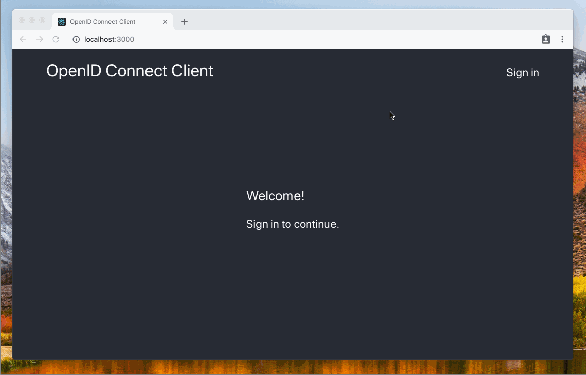

# Werther <sup>[1](#myfootnote1)</sup>

[![GoDoc][doc-img]][doc] [![Build Status][build-img]][build] [![codecov][codecov-img]][codecov] [![Go Report Card][goreport-img]][goreport]

Werther is an Identity Provider for [ORY Hydra][hydra] over [LDAP][ldap].
It implements [Login And Consent Flow][hydra-login-consent] and provides basic UI.



**Features**
- Support [Active Directory][ad];
- Mapping LDAP attributes to OpenID Connect claims;
- Mapping LDAP groups to user roles;
- OAuth 2.0 scopes;
- Caching users roles;
- UI customization.

**Limitations**
- Werther grants all requested permissions to a client without displaying the consent page;
- Werther confirms a logout request without displaying the logout confirmation page.

**Requirements**

ORY Hydra v1.0.0-rc.12 or higher.

**Table of Contents**
<!-- To generate the table use the command "npx doctoc --maxlevel 2 README.md" -->
<!-- START doctoc generated TOC please keep comment here to allow auto update -->
<!-- DON'T EDIT THIS SECTION, INSTEAD RE-RUN doctoc TO UPDATE -->


- [Installing](#installing)
- [Configuration](#configuration)
- [User roles](#user-roles)
- [UI customization](#ui-customization)
- [Example](#example)
- [Resources](#resources)
- [Footnotes](#footnotes)
- [Contributing](#contributing)
- [License](#license)

<!-- END doctoc generated TOC please keep comment here to allow auto update -->

## Installing

### From Docker

```bash
docker pull icoreru/werther
```

### From sources

```bash
go install ./...
```

## Configuration

The application is configured via environment variables.
Names of the environment variables starts with prefix `WERTHER_`.
See a list of the environment variables using the command:

```
werther -h
```

## User roles

In LDAP user's roles are groups in which a user is a member.

The environment variable `WERTHER_LDAP_ROLE_DN` is a DN for searching roles.

For example, create an OU that repserents an application, and then in the created OU
create groups that represent application's roles:

```
dc=com
|-- dc=example
    |-- ou=AppRoles
        |-- ou=App1
            |-- cn=app1_role1 (objectClass="group", description="role1")
            |-- cn=app1_role2 (objectClass="group", description="role2")
```

Run Werther with the environment variable `WERTHER_LDAP_ROLE_DN`
that equals to `ou=AppRoles,dc=example,dc=com`.

In the above example Werther returns user's roles as a value
of the user role's claim `https://github.com/i-core/werther/claims/roles`.

```json
{
    "https://github.com/i-core/werther/claims/roles": {
        "App1": ["role1", "role2"],
    }
}
```

To customize the roles claim's name you should set a value of the environment variable `WERTHER_LDAP_ROLE_CLAIM`.
For more details about claims naming see [OpenID Connect Core 1.0][oidc-spec-additional-claims].

**NB** There are cases when we need to create several roles with the same name in LDAP.
For example, when we want to configure multiple applications or several environments for the same application.

```
dc=com
|-- dc=example
    |-- ou=AppRoles
        |-- ou=Test
            |-- ou=App1
                |-- cn=test_app1_role1 (objectClass="group", description="role1")
                |-- cn=test_app1_role2 (objectClass="group", description="role2")
            |-- ou=App2
                |-- cn=test_app2_role1 (objectClass="group",description-"role1")
                |-- cn=test_app2_role2 (objectClass="group",description-"role2")
        |-- ou=Dev
            |-- ou=App1
                |-- cn=dev_app1_role1 (objectClass="group", description="role1")
                |-- cn=dev_app1_role3 (objectClass="group", description="role3")
            |-- ou=App2
                |-- cn=dev_app2_role1 (objectClass="group",description-"role1")
                |-- cn=dev_app2_role4 (objectClass="group",description-"role4")
```

Active Directory requires unique CNs in a domain. But in Active Directory
creating groups with the same CN in different OUs is difficult.
Because of it, Werther uses a LDAP attribute as a role's name instead of CN.
A name of a LDAP attribute is specified using the environment variable `WERTHER_LDAP_ROLE_ATTR`,
and has the default value `description`.

In the above example, Werther returns a response that contains the next roles:
* when the environment variable `WERTHER_LDAP_ROLE_DN` equals to `ou=Test,ou=AppRoles,dc=example,dc=com`:
    ```json
    {
        "https://github.com/i-core/werther/claims/roles": {
            "App1": ["role1", "role2"],
            "App2": ["role1", "role2"]
        }
    }
    ```
* when the environment variable `WERTHER_LDAP_ROLE_DN` equals to `ou=Dev,ou=AppRoles,dc=example,dc=com`:
    ```json
    {
        "https://github.com/i-core/werther/claims/roles": {
            "App1": ["role1", "role3"],
            "App2": ["role1", "role4"]
        }
    }
    ```

## UI customization

Werther uses the Go templates to render UI pages.
To customize the UI you should create a directory that contains UI pages' templates.
After that you should set the directory path to the environment variable `WERTHER_WEB_DIR`.

### Custom login page

A login page's template should contains blocks `title`, `style`, `script`, `content`.
Each block has access to data that is an object with the next properties:
- `CSRFToken` (string) - a CSRF token;
- `Challenge` (string) - a login challenge ID;
- `LoginURL` (string) - an endpoint that finishes the login process;
- `IsInvalidCredentials` (bool) - specifies that a user types an invalid username or password;
- `IsInternalError` (bool) specifies that an internal server error happens when finishing the login process.

When a login page's template contains static resources (like styles, scripts, and images)
they must be placed in a subdirectory called `static`.

For a full example of a login page's template see [source code](internal/web/templates).

## Example

1. Create file `ldap.ldif`:
    ```
    dn: uid=kolya_gerasyimov,ou=Users,dc=example,dc=com
    objectClass: inetOrgPerson
    cn: Kolya Gerasyimov
    sn: Gerasyimov
    uid: kolya_gerasyimov
    userPassword: 123
    mail: kolya_gerasyimov@example.com
    ou: Users

    dn: ou=AppRoles,dc=example,dc=com
    objectClass: organizationalunit
    ou: AppRoles
    description: AppRoles

    dn: ou=App1,ou=AppRoles,dc=example,dc=com
    objectClass: organizationalunit
    ou: App1
    description: App1

    dn: cn=traveler,ou=App1,ou=AppRoles,dc=example,dc=com
    objectClass: groupofnames
    cn: traveler
    description: traveler
    member: uid=kolya_gerasyimov,ou=Users,dc=example,dc=com
    ```

2. Create file `docker-compose.yml`:
    ```yaml
    version: "3"
    services:
        hydra-client:
            image: oryd/hydra:v1.0.0-rc.12
            environment:
                HYDRA_ADMIN_URL: http://hydra:4445
            command:
                - clients
                - create
                - --skip-tls-verify
                - --id
                - test-client
                - --secret
                - test-secret
                - --response-types
                - id_token,token,"id_token token"
                - --grant-types
                - implicit
                - --scope
                - openid,profile,email
                - --callbacks
                - http://localhost:3000
                - --post-logout-callbacks
                - http://localhost:3000/post-logout-callback
            networks:
                - hydra-net
            deploy:
                restart_policy:
                    condition: none
            depends_on:
                - hydra
            healthcheck:
                test: ["CMD", "curl", "-f", "http://hydra:4445"]
                interval: 10s
                timeout: 10s
                retries: 10
        hydra:
            image: oryd/hydra:v1.0.0-rc.12
            environment:
                URLS_SELF_ISSUER: http://localhost:4444
                URLS_SELF_PUBLIC: http://localhost:4444
                URLS_LOGIN: http://localhost:8080/auth/login
                URLS_CONSENT: http://localhost:8080/auth/consent
                URLS_LOGOUT: http://localhost:8080/auth/logout
                WEBFINGER_OIDC_DISCOVERY_SUPPORTED_SCOPES: profile,email,phone
                WEBFINGER_OIDC_DISCOVERY_SUPPORTED_CLAIMS: name,family_name,given_name,nickname,email,phone_number
                DSN: memory
            command: serve all --dangerous-force-http
            networks:
                - hydra-net
            ports:
                - "4444:4444"
                - "4445:4445"
            deploy:
                restart_policy:
                    condition: on-failure
            depends_on:
                - werther
        werther:
            image: icoreru/werther:v1.0.0
            environment:
                WERTHER_IDENTP_HYDRA_URL: http://hydra:4445
                WERTHER_LDAP_ENDPOINTS: ldap:389
                WERTHER_LDAP_BINDDN: cn=admin,dc=example,dc=com
                WERTHER_LDAP_BINDPW: password
                WERTHER_LDAP_BASEDN: "dc=example,dc=com"
                WERTHER_LDAP_ROLE_BASEDN: "ou=AppRoles,dc=example,dc=com"
            networks:
                - hydra-net
            ports:
                - "8080:8080"
            deploy:
                restart_policy:
                    condition: on-failure
            depends_on:
                - ldap
        ldap:
            image: pgarrett/ldap-alpine
            volumes:
                - "./ldap.ldif:/ldif/ldap.ldif"
            networks:
                - hydra-net
            ports:
                - "389:389"
            deploy:
                restart_policy:
                    condition: on-failure
    networks:
        hydra-net:
    ```

3. Run the command:
    ```bash
    docker stack deploy -c docker-compose.yml auth
    ```

4. Open the browser with http://localhost:4444/oauth2/auth?client_id=test-client&response_type=token&scope=openid%20profile%20email&state=12345678.

## Resources

- [Introduction to ORY Hydra, OAuth 2.0, and OpenID Connect][hydra-doc];
- [ORY Hydra: Integrating with (existing) User Management][hydra-login-consent];
- [ORY Hydra: Configuration][hydra-doc-config];
- [ORY Hydra: Official User Login & Consent Example][hydra-login-consent-example];
- [OpenID Connect Core 1.0][oidc-spec-core];
- [OpenID Connect Session Management 1.0][oidc-spec-session];
- [OpenID Connect Front-Channel Logout 1.0][oidc-spec-front-channel-logout];
- [OpenID Connect Back-Channel Logout 1.0][oidc-spec-back-channel-logout].

## Footnotes

1. <a name="myfootnote1"></a> Werther is named after robot Werther from [Guest from the Future](https://en.wikipedia.org/wiki/Guest_from_the_Future).

## Contributing

Thanks for your interest in contributing to this project.
Get started with our [Contributing Guide][contrib].

## License

The code in this project is licensed under [MIT license][license].

[doc-img]: https://godoc.org/github.com/i-core/werther?status.svg
[doc]: https://godoc.org/github.com/i-core/werther

[build-img]: https://travis-ci.com/i-core/werther.svg?branch=master
[build]: https://travis-ci.com/i-core/werther

[codecov-img]: https://codecov.io/gh/i-core/werther/branch/master/graph/badge.svg
[codecov]: https://codecov.io/gh/i-core/werther

[goreport-img]: https://goreportcard.com/badge/github.com/i-core/werther
[goreport]: https://goreportcard.com/report/github.com/i-core/werther

[contrib]: https://github.com/i-core/.github/blob/master/CONTRIBUTING.md
[license]: LICENSE

[ldap]: https://ldap.com/
[ad]: https://docs.microsoft.com/ru-ru/windows/desktop/AD/active-directory-domain-services

[hydra]: https://www.ory.sh/
[hydra-doc]: https://www.ory.sh/docs/hydra/
[hydra-login-consent]: https://www.ory.sh/docs/hydra/oauth2
[hydra-login-consent-example]: https://github.com/ory/hydra-login-consent-node
[hydra-doc-config]: https://www.ory.sh/docs/hydra/configuration

[oidc-spec-core]: https://openid.net/specs/openid-connect-core-1_0.html
[oidc-spec-additional-claims]: https://openid.net/specs/openid-connect-core-1_0.html#AdditionalClaims
[oidc-spec-session]: https://openid.net/specs/openid-connect-session-1_0.html
[oidc-spec-front-channel-logout]: https://openid.net/specs/openid-connect-frontchannel-1_0.html
[oidc-spec-back-channel-logout]: https://openid.net/specs/openid-connect-backchannel-1_0.html
